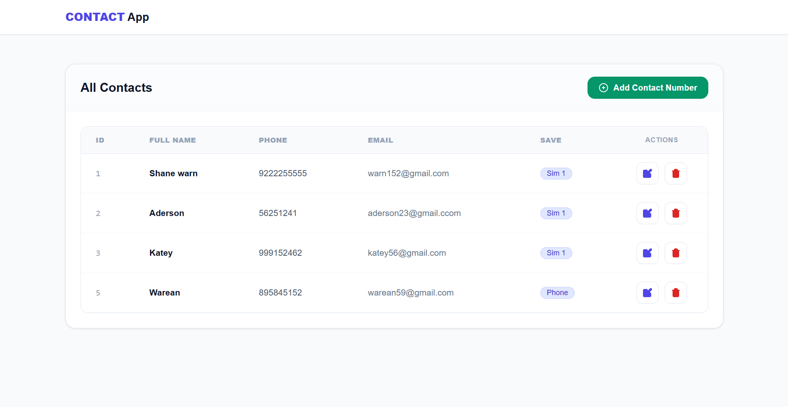
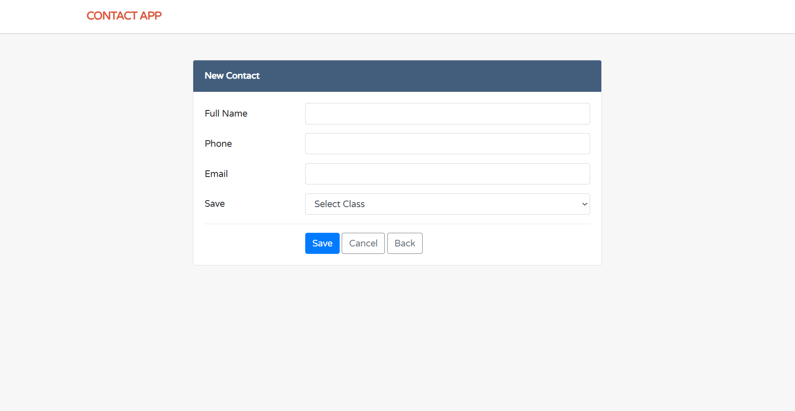
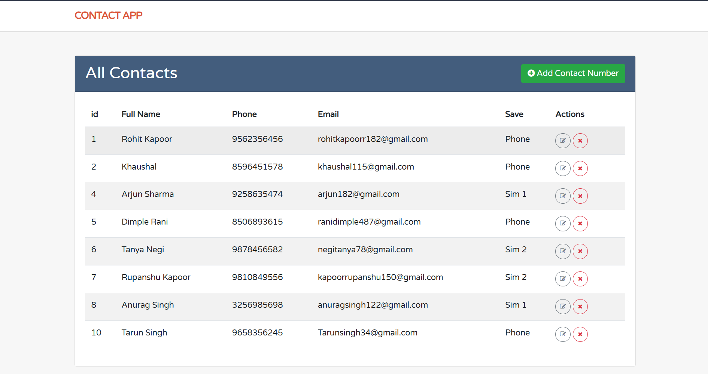
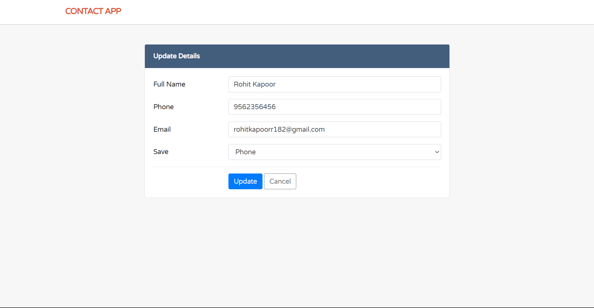
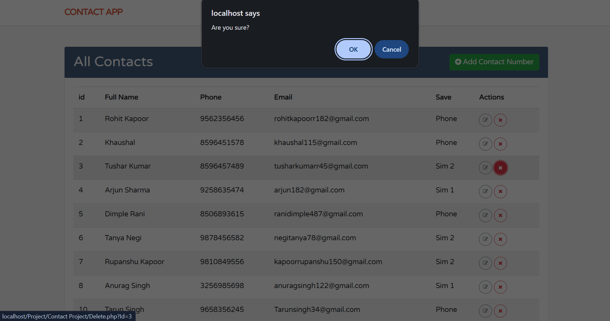

# 📱 Contact System

A Simple and user-friendly Contact Management System built using **PHP, MySQL and Tailwind Css**.

This project allows users to manage contact information through a clean and responsive web interface.

## 🚀 Features

- Add new contacts
- View all contacts
- Display contact details
- Update existing contacts
- Store contacts in MySQL database
- Auto Increment ID
- Save contact location such as Phone / SIM
- Bootstrap responsive UI
- PHP and MySQL database connectivity

## 🛠️ Technologies Used

- HTML5
- Tailwind Css
- PHP
- MySQL
- XAMPP
- Font Awesome

## 📂 Project Structure

Contact-Project
├── home.php
├── form.php
├── store.php
├── update.php
├── Delete.php

<h2>🗄️ Database</h2>

The project uses MySQL for storing contact information.

<h3>Contact Table</h3>

The contact table stores:

<ul>
<li>ID</li>
<li>Full Name</li>
<li>Phone</li>
<li>Email</li>
<li>Save</li>
</ul>
<h2>⚙️ How to Run</h2>
<ul>
<li>Install XAMPP.</li>
<li>Start Apache and MySQL from XAMPP.</li>
<li>Copy the project folder into:</li>
<li>C:\xampp\htdocs\</li>
<li>Create a MySQL database named:</li>
<li>contact_project</li>
<li>Create the required tables and columns.</li>
<li>Open the project in your browser:</li>
<li>http://localhost/Contact/</li>
</ul>

<h2>🎯 Project Purpose</h2>
<ul>
<li>This project was created to practice:</li>
<li>PHP CRUD operations</li>
<li>MySQL database connectivity</li>
<li>HTML forms</li>
<li>Bootstrap styling</li>
<li>PHP GET and POST methods</li>
<li>SQL INSERT, SELECT and UPDATE queries</li>
<li>Dynamic data fetching from MySQL</li>

</ul>
<h3>👨‍💻 Author</h3>

Rohit Kapoor

Skills Practiced

 HTML | Tailwind CSS | PHP | MySQL |

 <h1>Contact App Dashboard</h1>
 

<h1>Add New Contact</h1>
 

<h1>Update Contact Detail</h1>
 

<h1>Contact Delete Message</h1>

<h1>Contact is Delete to Dashboard</h1>

